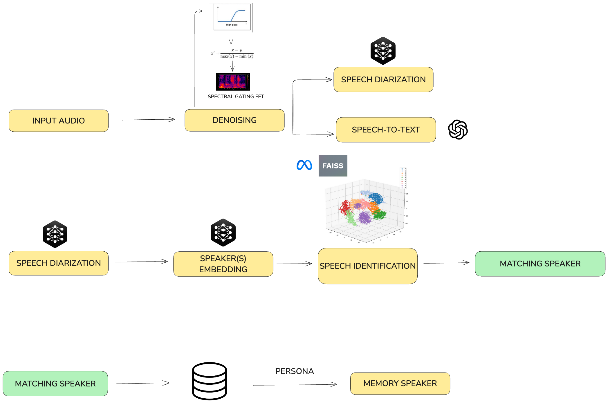

<p align="center">
  
</p>
<h1 align="center">
  Adaptis <br>
  Working With You to Deliver More.
</h1>
<p align="center">
<a href="./presentation.pptx">Presentation (PowerPoint)</a> •
<a href="./presentation.pdf">Presentation (PDF)</a> •
<a href="./demo.mp4">Demo (Video)</a>
</p>

<h4 align="center">An advanced voice recognition system for multi-speaker environments with contextual memory</h4>

<p align="center">
  <a href="#key-features">Key Features</a> •
  <a href="#components">Components</a> •
  <a href="#installation">Installation</a> •
  <a href="#usage">Usage</a> •
  <a href="#api-reference">API Reference</a> •
  <a href="#use-cases">Use Cases</a> •
  <a href="#troubleshooting">Troubleshooting</a> •
  <a href="#contributing">Contributing</a>
</p>

# Introduction

This project is our submission for the [Helbling](https://www.helbling.ch/) challenge at [START Hack 2025](https://www.startglobal.org/start-hack/home/). The challenge tasked us with developing an AI assistant capable of distinguishing multiple voices in a noisy environment, simulating an autonomous waiter in a bustling restaurant setting. Our solution, Adaptis, leverages advanced voice recognition and natural language processing to create a seamless interaction between customers and the AI waiter, showcasing the potential of AI in enhancing customer service in the hospitality industry.

# Key Features

* **Multi-Speaker Recognition** - Identifies different speakers in a conversation using voice embeddings
* **Single-Message Multi-Speaker Compatibility** - Each message can contain voice from multiple clients, the voices and content will be separated and treated accordingly.
* **Noise Reduction** - Advanced audio processing to isolate main voices from background noise
* **Real-Time Transcription** - Live speech-to-text conversion as audio is being recorded
* **Speaker Diarization** - Separates and labels audio by individual speakers
* **Contextual Memory** - Maintains conversation history and preferences for each identified speaker
* **Privacy-Focused** - Built with data security and user privacy as core principles


# Components

The system architecture consists of multiple specialized modules:



# Speaker Recognition Module

Implements real-time speaker identification using SpeechBrain's ECAPA-VOXCELEB model for generating voice embeddings and FAISS for efficient similarity search. The system:
- Generates 192-dimensional speaker embeddings using SpeechBrain
- Uses FAISS IndexFlatIP for fast similarity-based speaker matching
- Maintains a dynamic speaker database with automatic new speaker registration
- Supports preloading of known speaker profiles

# Audio Processing Pipeline

```
Raw Audio → DeepFilterNet Noise Reduction → High-pass Filtering (100Hz) → Audio Normalization → Pyannote Speaker Diarization → Whisper Transcription
```

# Memory Management System

Implements a persona-based memory system that:
- Maintains conversation history and speaker profiles
- Generates dynamic speaker personas using OpenAI's API
- Groups conversations by speaker for contextual memory retrieval
- Supports real-time updates and persistence of conversation context

# API Server

Flask-based server providing:
- RESTful endpoints for audio processing and transcription
- WebSocket support for real-time speech-to-text streaming
- Session management for continuous voice recognition
- Memory persistence and retrieval endpoints

# Project Structure

```
└── StartHack25
    ├── frontend # contains a react frontend for the demo embedding https://voiceoasis.azurewebsites.net/
    └── src
        ├── speaker_recognition
        │   ├── __init__.py
        │   ├── audios              # Pre-loaded speaker audio samples
        │   │   └── *.wav           # Sample audio files for known speakers
        │   ├── embedder.py         # SpeechBrain embedding generation
        │   ├── utils.py            # Speaker recognition utilities
        │   └── vector_database.py  # FAISS-based speaker matching
        ├── memoryprocessing.py     # Conversation context and persona management
        ├── openai_api_example.py   # OpenAI API integration examples
        ├── relay.py               # Main Flask API server
        ├── utils.py               # Audio processing and utility functions
        ├── visualize_noise_filter_results.ipynb  # Noise filtering analysis
        └── websocket_adapter.py   # WebSocket client for real-time streaming
```

# Installation

## Prerequisites

- Python 3.12+
- PyTorch
- CUDA (optional, for GPU acceleration)

## Setup

1. Clone the repository:
   ```
   git clone https://github.com/your-username/StartHack25.git
   cd StartHack25
   ```

2. Create and activate the Conda environment:
   ```
   conda env create -f environment.yml
   conda activate starthack25
   ```

3. Install additional dependencies:
   ```
   pip install -r requirements.txt
   ```

4. Set up environment variables:
   ```
   cp .env.example .env
   ```
   Edit the `.env` file with your API keys and configuration.

5. Run the application:
   ```
   python src/relay.py
   ```

# Limitations

- LLM Hallucinations: The system may occasionally produce inaccurate or irrelevant responses due to limitations in language model understanding.
- Incomplete Dockerization: The current implementation lacks full containerization, which may affect deployment consistency across different environments.
- Performance in Noisy Environments: In scenarios with multiple background voices, the denoising algorithm's effectiveness may be reduced, impacting overall system performanc, although it should still be considered reliable.
- Ongoing Denoising Improvements: Further refinement of the noise reduction techniques is needed to enhance audio quality in challenging acoustic environments.
- Frontend Integration: Due to limited access to the frontend application and the actual system prompt of the agent, some features may not be fully optimized for user interaction.
- Memory Management Workarounds: The current implementation of memory management relies on temporary solutions, which may impact long-term scalability and efficiency.


# Remarks
This implementation is based on the following repository: https://github.com/START-Hack/Helbling_STARTHACK25/tree/main
